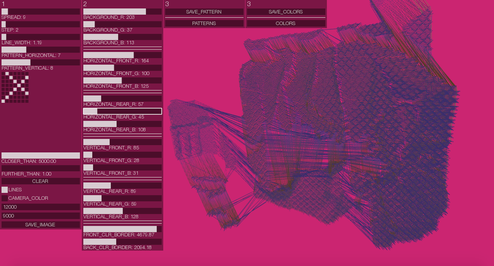

## Synopsis

data-tex-styles allows you to "weave" 3D scans obtained from RGBD sensors using textile design patterns. It is the result of collaboration of Zuzana Zmateková and [Matej Fandl](http://www.mladypes.sk). See it in action [here](https://www.youtube.com/watch?v=zAPDYh8-FzM).

## Installation

The software was developed using [http://openframeworks.cc](openFrameworks) 0.8.4 and quickly ported to 0.9.8 on November 29 2016. It relies on the following addons:

* ofxKinect
* [ofxUI](https://github.com/rezaali/ofxUI) [deprecated now]
* ofxXmlSettings

## License

Apache License 2.0 - see LICENSE.txt for details.
